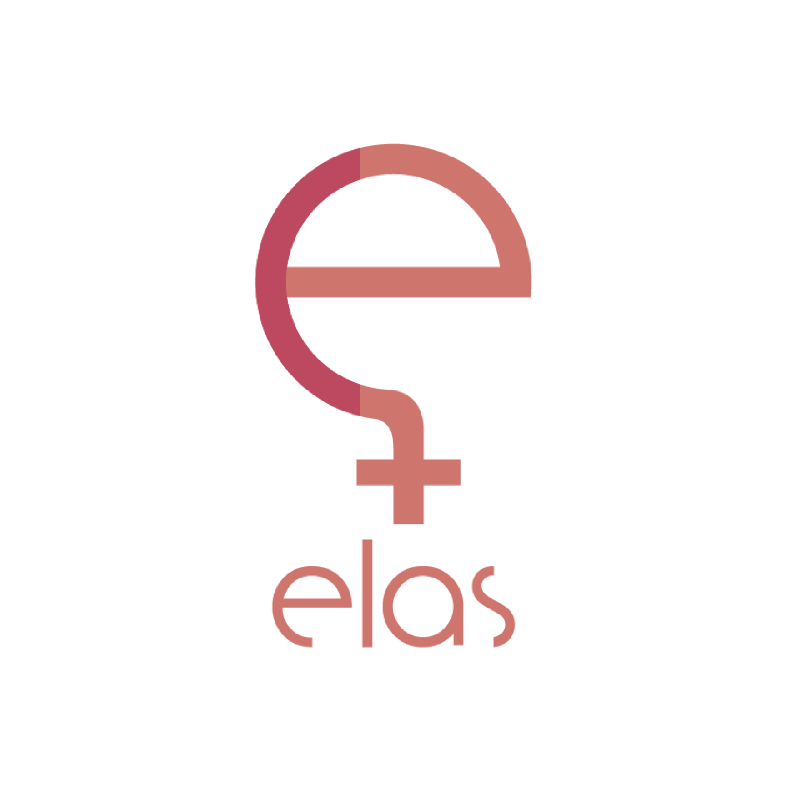

# 👶 BabySteps

Aqui iniciaremos as suas primeiras contribuições na organização. Lembre-se de seguir o nosso [código de conduta](https://github.com/elasComputacao/Site/blob/master/codigo-de-conduta.md) ao contribuir. Antes de colocar a mão na massa, uma breve introdução:

## :question: **Quem somos**
O Elas@Computação surge com o objetivo de reunir mulheres do curso de Ciência da Computação da Universidade Federal de Campina Grande. Nosso foco é levantar, discutir e impulsionar os assuntos que dizem respeito ao feminino, feminismo, nossos espaços, falas, movimentos e necessidades. A nossa missão é inspirar mulheres mostrando que todas são capazes de trabalhar e serem as melhores profissionais na área que Elas quiserem. Somos uma comunidade que se apoia e que está disposta sempre a acolher novas membras e continuamente ajudá-las a se desenvolverem como mulheres e profissionais.

Com base no nosso propósito como organização, vamos iniciar suas contribuições com o pé direito!

## :woman_technologist: Mulheres incríveis
Criamos uma galeria com mulheres incríveis, queremos que você conheça algumas das várias mulheres que fazem a diferença na nossa área.
Para contribuir, adicione [aqui](galeria) um arquivo em markdown com o nome da mulher escolhida, descrevendo quem ela é.

## :scroll: Frases inspiradoras
"Mulheres que programam escrevem o futuro", assim iniciamos a nossa coletânea com frases inspiradoras sobre **tecnologia** e **capacitação feminina**, queremos que você se sinta bem e motivada ao ler cada uma delas. 
Para contribuir, adicione uma nova frase [aqui](Frases.md).

## :earth_americas: Hello World
Não poderia faltar a sua sorte na linguagem, deposite [aqui](HelloWorld) seu HelloWorld em qualquer linguagem. Lembre de adicioná-lo na pasta referente a sua linguagem, se já houver um arquivo com o mesmo nome pode colocar por exemplo: 
` hello-word-3.py `

Com isso, chegamos ao fim da sua primeira contribuição, que cada uma possa contribuir como puder, mas que sejamos sempre símbolo de acolhimento. 
Seja muito bem vinda a nossa comunidade no GitHub ❤️

## :computer: URI
Após o seu primeiro Hello Word, podemos começar os **primeiros programas**! Para isso criamos um diretório a fim de aprimorar o conhecimento das nossas integrantes, com as mais diversas soluções e linguagens. 

Para contribuir, adicione o número da questão no nome do seu arquivo e a linguagem dentro [deste diretório](URI).
